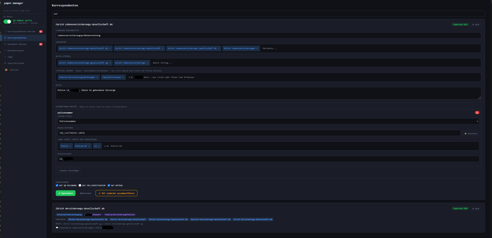
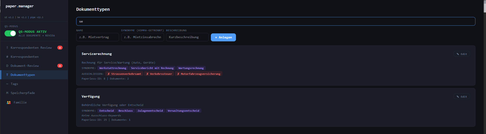
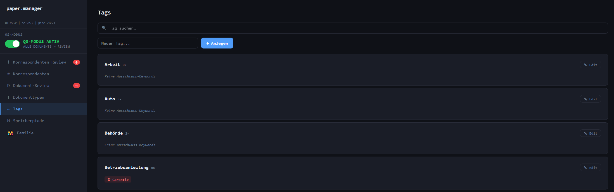
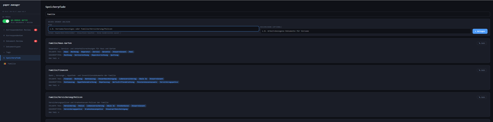

# paperless-ngx-classifier

**AI-powered document classification pipeline for Paperless-NGX — local LLMs, Vision OCR, auto-learning, zero cloud.**

> Scan a document. Walk away. Come back to a fully classified, tagged, and filed document — with the right correspondent, storage path, document type, and custom fields filled in. No cloud. No subscription. No data leaving your home.

[🇩🇪 Deutsche Version](README.de.md)

---

## Why does this exist?

[Paperless-NGX](https://docs.paperless-ngx.com/) is an excellent document management system — but its built-in classification is limited to OCR text matching and simple rules. It cannot:

- Analyse the document **as an image** (logo recognition, layout, handwriting)
- Detect **handwritten notes** (e.g. a payment date scribbled in the corner)
- Route documents based on **vehicle licence plates** without manual rules
- Learn from **your corrections** and improve over time
- Parse **Swiss QR-Bill** data and populate custom fields automatically

This project adds an intelligent pre/post-consume pipeline to Paperless-NGX that addresses all of these — using **local LLMs via Ollama**, so your documents never leave your infrastructure.

---

## How it works

```
Scanner
  ↓
pre_consume.sh        — OCR optimisation (ocrmypdf) + barcode splitting
pre_consume_qr.py     — Swiss QR-Bill parsing (IBAN, amount, reference, due date)
  ↓
post_consume.py       — Main pipeline (runs after every successful scan)
  ├─ Vision LLM       — Analyses document as image: sender, date, amount,
  │                     licence plate, handwritten notes ("bez. 6.2.26" → paid)
  │                     household context injected: members (never senders) + employers
  ├─ RAG              — Embeddings (bge-m3) match document to known folders
  ├─ LLM              — Classifies document type, tags, storage path
  ├─ Sanitiser        — Validates against manifest, exclusion keywords;
  │                     known type not in folder manifest → auto-add + confidence mittel
  ├─ Deterministic    — Licence plates (family.json) + relationship matches from
  │   routing           correspondents.json: ref-number, single-match, Vision recipient
  │                     bypass LLM entirely (~100% accurate)
  ├─ fix_tags         — Deterministic tags from 3 levels merged in order:
  │                     relationship → correspondent → document type
  ├─ Paperless API    — Patches correspondent, tags, path, custom fields
  └─ Pipeline note    — Structured note written to Paperless notes field:
                        routing stage, correspondent, folder, doc type,
                        confidence, Vision fields, LLM model — for debugging
                        and traceability. Replaces prior pipeline notes;
                        manual notes are untouched.
  ↓
paper.manager         — Browser UI for reviewing uncertain documents,
(port 8100)             managing correspondents, document types, tags,
                        storage paths, and household configuration
```

### The learning loop

Every correction you make in paper.manager feeds back into the system:

- Approved correspondents → added to `correspondents.json` with match strings
- Reclassified documents → allowed tags updated in the manifest
- Document type known but not in folder manifest → manifest auto-updated, confidence mittel (self-healing)
- Known senders → never go into the review queue again
- Deterministic routing → grows over time, reducing LLM calls

Over time: **more deterministic, less LLM, faster, more accurate.**

---

## Key features

### Vision-first analysis
Every document is analysed as an **image** by a multimodal LLM (`qwen2.5vl`), not just as OCR text. This catches logos, layouts, stamps, and handwriting that OCR misses.

### Handwriting recognition
Someone writes `bez. 6.2.26` in the top-right corner of paid invoices. The vision model reads it, `parse_handschrift_bezahlt()` extracts the date, and Paperless gets:
- Custom field `Status` → `Bezahlt`
- Custom field `Bezahlt am` → `2026-02-06`

This enables a killer use case: search Paperless for `Bezahlt am = 2026-02-06` and cross-reference with your e-banking statement for that day.

### Swiss QR-Bill parsing
Automatically extracts and populates:
- Amount (`CHF`)
- Invoice number
- Customer number
- QR reference (27-digit)
- Due date (`Fällig am`)

### Deterministic routing

Two sources bypass the LLM entirely:

**Licence plates** — configured as vehicles in `family.json`. When Vision spots a known plate, the document is routed directly.

**Correspondent relationships (`beziehungen`)** — configured per correspondent in `correspondents.json` and managed via the paper.manager UI. Three match modes:

| Mode | Condition | Result |
|---|---|---|
| Licence plate | Plate spotted in image | Folder from `family.json` |
| Ref. number | OCR/Vision text matches `extraktion_muster` regex | Fixed folder + doc type from relationship |
| Ref. number + tiebreaker | Multiple ref-matches: `dokumenttyp_visuell` from Vision resolved via synonym map against `erlaubte_doctypen` | Deterministic, no LLM |
| Single relationship | Correspondent has exactly 1 configured relationship | Folder deterministic; doc type if uniquely defined |
| Vision recipient | Vision identifies recipient = known person in relationship | Fixed folder; doc type if uniquely defined |

Household member names are injected into every Vision prompt so the model knows these are never the document sender.

### fix_tags — deterministic tag assignment

Tags can be defined at three levels and are applied in order, fully merged and deduplicated, **without any LLM involvement**:

| Level | Source | Applies when |
|---|---|---|
| 1 — Relationship | `beziehungen[].fix_tags` | This specific relationship matched |
| 2 — Correspondent | `correspondents.json fix_tags` | Any document from this sender |
| 3 — Document type | `document_types.json fix_tags` | Document classified as this type |

Combined with `verbotene_tags`, `verbotene_doctypen`, and `verbotene_ordner` per correspondent, the pipeline enforces hard constraints before the LLM is consulted.

### Custom fields — automatically filled

| Field | Type | Source |
|---|---|---|
| CHF | Monetary | QR-Bill |
| Invoice number | Text | QR-Bill / Vision |
| Customer number | Text | Vision |
| QR reference | Text | QR-Bill |
| Due date | Date | QR-Bill |
| Status | Select | Auto (Open/Paid) |
| Policy number | Text | Vision |
| Licence plate | Select | Vision + family.json |
| Paid on | Date | Handwriting `bez.` |
| Scanned on | Date | Always = today |

### paper.manager UI
A single-page browser UI (no framework, no build step) for:
- **Correspondent review** — approve, reject, or merge unknown senders
- **Document review** — document thumbnail, AI fields (title, correspondent, folder, type, date, colour-coded confidence, review reason, **LLM reasoning**), set tags as chips, custom fields, correction form (folder, correspondent, type, tags)
- **Document types** — manage synonyms and exclusion keywords
- **Tags** — manage exclusion keywords per tag
- **Storage paths** — configure folders with allowed tags and document types
- **Family config** — persons, vehicles, relationships (employer, bank, health insurer, doctor), household name (no hardcoding in code)
- **Kürzel (abbreviation)** — 2–6 character unique shortcode per correspondent (e.g. `UBS`, `ZV`); shown as badge, searchable, live uniqueness check
- **Paperless link** — direct «Paperless-NGX öffnen ↗» button in sidebar and on Home tab; URL read from `PAPERLESS_URL` in `.env`
- **Version display** — shows active versions of all components in the sidebar

---

## Before / After

| | Without this pipeline | With this pipeline |
|---|---|---|
| Sender detection | OCR text matching only | Vision + fuzzy matching + learning |
| Document type | Manual or simple rules | LLM + synonym resolution + exclusions |
| Handwriting | Not possible | Recognised and parsed |
| Deterministic routing | Manual rule per document | Licence plates (family.json) + relationships per correspondent (3 match modes: ref-nr, single, Vision) — configured in UI, ~100% accurate |
| Custom fields | Manual | Automatic (QR-Bill + Vision) |
| Unknown senders | Silent failure | Review queue with suggested values |
| Corrections | Lost | Feed back into next classification |
| Data privacy | Depends on OCR/AI service | 100% local, zero cloud |

---

## Requirements

| Component | Details |
|---|---|
| Paperless-NGX | v2.x, Docker |
| Ollama | Separate server recommended (GPU) |
| Python | 3.11+ on Paperless host |
| OS | Debian 12 / Ubuntu 24.04 (others possible) |

### Recommended Ollama models

| Model | Purpose | Min. RAM |
|---|---|---|
| `qwen2.5vl:7b` | Vision — image analysis | 16 GB |
| `llama3.3:70b` | LLM — classification | 64 GB (CPU possible) |
| `bge-m3` | Embeddings (optional, improves RAG) | — |

> Tested on GMKtec EVO with AMD Ryzen AI Max+ 395, 128 GB RAM. Slower hardware works too — processing time increases but quality is the same. With learning, fewer LLM calls are needed over time.

---

## Quick start

```bash
git clone https://github.com/lastphoenx/paperless-ngx-classifier.git /tmp/classifier

# Deploy scripts
cp /tmp/classifier/post_consume.py        /opt/paperless-scripts/
cp /tmp/classifier/pre_consume.sh         /opt/paperless-scripts/
cp /tmp/classifier/pre_consume_qr.py      /opt/paperless-scripts/
cp /tmp/classifier/correspondent_manager_app.py /opt/paperless-scripts/
cp /tmp/classifier/paper_manager_ui.html  /opt/paperless-scripts/

# Initialise training files
mkdir -p /opt/paperless-scripts/training
cp /tmp/classifier/training/family.example.json         /opt/paperless-scripts/training/family.json
cp /tmp/classifier/training/document_types.example.json /opt/paperless-scripts/training/document_types.json
cp /tmp/classifier/training/manifest.example.json       /opt/paperless-scripts/training/manifest.json
cp /tmp/classifier/training/correspondents.example.json /opt/paperless-scripts/training/correspondents.json
cp /tmp/classifier/training/tags.example.json           /opt/paperless-scripts/training/tags.json

# Configure
cp /tmp/classifier/.env.example /opt/paperless/.env
nano /opt/paperless/.env
```

**Full installation guide** → [`INSTALL.md`](INSTALL.md)  
**User handbook (paper.manager)** → [`docs/Benutzerhandbuch_paper_manager.md`](docs/Benutzerhandbuch_paper_manager.md)

> **`docker-compose.yml`** included in this repo is a **template** for a full Paperless-NGX Docker stack (DB, broker, webserver). Use it only if Paperless is not yet installed. Adapt all paths, passwords, and volumes before use — see `.env.example` for all variables.

---

## Configuration files (`training/`)

| File | Purpose |
|---|---|
| `family.json` | Household: persons and vehicles — basis for folder structure, licence-plate routing, and Vision prompt context |
| `correspondents.json` | Known senders: fuzzy match rules, extraction patterns, relationships (`beziehungen[]`), `fix_tags[]`, `verbotene_doctypen`, `verbotene_ordner`, `verbotene_tags` |
| `document_types.json` | Document types with synonyms and exclusion keywords |
| `manifest.json` | Storage folder structure with allowed tags and document types |
| `tags.json` | Tags with exclusion keywords |
| `pending_mode.txt` | Pipeline mode: `always` / `uncertain` / `never` |

> These files are **not** included in the repo (they contain personal data). Example files with placeholder values are provided for each.

### `.env` — notable variables

| Variable | Default | Purpose |
|---|---|---|
| `CONFIDENCE_IGNORE_TAG_PATTERNS` | `^\d{4}$,^\d{1,2}\.\d{4}$` | Regex patterns for tags that do **not** lower confidence (year numbers, month.year). Comma-separated. Set empty to disable. |
| `CF_BEZAHLT_AM_ID` | — | Paperless custom field ID for "paid on" date |
| `CF_GESCANNT_AM_ID` | — | Paperless custom field ID for "scanned on" date |
| `OLLAMA_REGEX_MODEL` | `llama3.3:70b` | Separate Ollama model for the Regex-Assistent in paper.manager (falls back to `OLLAMA_MODEL`) |

See `.env.example` for all variables with descriptions.

---

## Screenshots

| | |
|---|---|
|  |  |
|  |  |

---

## paper.manager UI

Available at `http://SERVER_IP:8100` after installation.

| Tab | Purpose |
|---|---|
| Home | System overview, feature summary, component versions |
| Correspondent Review | Approve / reject / merge unknown senders |
| Correspondents | Edit known senders — match rules, fix_tags, verbotene_*, beziehungen |
| Document Review | Thumbnail + AI fields + colour-coded confidence + LLM reasoning + correction form (proxy preview for IP access, v2.8+) |
| Document Types | Synonyms + exclusion keywords |
| Tags | Exclusion keywords per tag |
| Speicherpfade | Folder configuration |
| Familie | Household name, persons, vehicles; relationship overview across all correspondents |

---

## ⚠️ Critical: Disable Paperless-NGX Built-in Classifier

This is the **most important configuration step**. Skip it and documents will be misclassified — even when Vision correctly identifies the sender.

### The Problem

Paperless-NGX runs its own ML classifier that assigns correspondents, tags, and document types **before** `post_consume.py` runs. The result is embedded in the filename passed to our script — corrupting the LLM prompt even when Vision identified the correct sender.

**Symptom:** Document lands in wrong folder despite correct Vision recognition. Log shows e.g. `Datei=2026-05-25 Wrong Correspondent_document.pdf` even though the document is from a different sender.

### Solution — Three steps required

**1. Disable training** in `/opt/paperless/.env`:
```bash
PAPERLESS_TRAIN_TASK_CRON=disable
```

**2. Restart Docker:**
```bash
cd /opt/paperless && docker compose down && docker compose up -d
```

**3. Set all correspondents, document types and tags to «No matching»:**
```bash
export TOKEN=$(grep "PAPERLESS_TOKEN=" /opt/paperless/.env | head -1 | cut -d= -f2)

for endpoint in correspondents document_types tags; do
  echo "Processing ${endpoint}..."
  curl -s "http://localhost:8000/api/${endpoint}/?page_size=100" \
    -H "Authorization: Token $TOKEN" | python3 -m json.tool | grep '"id"' | \
    grep -o '[0-9]*' | while read id; do
      curl -s -X PATCH "http://localhost:8000/api/${endpoint}/$id/" \
        -H "Authorization: Token $TOKEN" -H "Content-Type: application/json" \
        -d '{"matching_algorithm": 0}' > /dev/null
      echo "  ${endpoint} $id → no matching ✓"
  done
done
```

> New objects created via paper.manager are automatically set to `matching_algorithm=0`. This reset is a one-time operation for existing data.
>
> Full step-by-step procedure → [INSTALL.md](INSTALL.md#schritt-9----paperless-built-in-classifier-deaktivieren-pflicht)

---

## Recommendations: Document Types and Tags

### Keep document types broad and stable

The LLM reliably hits broad categories. Avoid creating a type for every edge case.

**Recommended set (23 types):**

| Type | Covers |
|---|---|
| Rechnung | General invoices |
| Arztrechnung | Medical invoices |
| Servicerechnung | Service/maintenance |
| Reparaturrechnung | Repairs |
| Versicherungsabrechnung | Insurance premiums |
| Police | All insurance policies |
| Lohnabrechnung | Monthly payslip |
| Lohnausweis | Annual wage statement (tax-relevant) |
| Steuerwertbescheinigung | Tax value certificates |
| Steuerdokument | Tax returns, refunds |
| Gesundheitsdossier | Medical reports, prescriptions, lab results |
| Arbeitgeberdokument | Employment certificates, termination letters |
| Auto | Vehicle documents, MFK, damage reports |
| Banken | Bank statements, depot, securities |
| Behördenpost | Official correspondence, ID documents |
| Verfügung | Official decisions |
| Vertrag | All contracts |
| Korrespondenz | Letters, invitations, general correspondence |
| Garantieschein | Warranties |
| Betriebsanleitung | Manuals |
| Quittung | Receipts, delivery notes |
| Schulzeugnis | School documents |
| Vermögensausweis | Asset/depot statements |

### Use tags for cross-cutting concerns

- `Steuerrelevant` — anything needed for the tax return
- `Mahnung` — reminders regardless of document type or sender
- Pending tags (`pending_review`, `pending_new_correspondent`, `pending_qs`) — set by pipeline only, do not assign via Paperless classifier

---

## Troubleshooting

| Problem | Solution |
|---|---|
| Wrong folder despite correct Vision | Paperless classifier not disabled — run the reset above |
| `Arztbericht` as type on first scan of new doc type | Type was known but not yet in folder manifest — auto-added, next scan routes correctly (self-healing) |
| Confidence always mittel | Check `CONFIDENCE_IGNORE_TAG_PATTERNS` in `.env` |
| `Scan_` titles, files as `0000xxx.pdf` | `post_consume.py` crashed — re-consume PDF after fixing the error |
| `Field required` on document approve | Deploy `correspondent_manager_app.py` v2.2+ |
| Login via IP redirects wrongly | Check `PAPERLESS_INTERNAL_URL` in `.env` (set to `http://localhost:8000`) |
| Permissions wrong | `python3 fix_all_perms.py` |
| Embeddings stale | `rm training/manifest_embeddings.json` |

---

## Security note

- **Never** commit `.env` — it contains API tokens, DB password, and secret key
- `training/*.json` / `training/*.jsonl` contain personal data → not committed
- `.gitignore` in this repo already protects these files
- paper.manager is protected by Paperless session cookie; put Authentik or nginx basic auth in front for production use

---

## Licence

MIT

---

## ⚠️ Disclaimer / Haftungsausschluss — AI-Generated Code

> **WORK IN PROGRESS** — New features are being added, existing ones are being tested and improved. For productive use, please run your own tests and check for updates regularly.

### 🇬🇧 English: AI-Generated Code Notice

This repository was created using multiple AI systems. The code has been **entirely generated by AI** — not a single line was manually written by a human. All development took place in **Microsoft Visual Studio Code (VS Code)** using **GitHub Copilot** and various AI models.

**My role as developer:**
- ✅ Designed logic and architecture
- ✅ Guided and optimised prompts
- ✅ Reviewed code and reported errors
- ✅ Conducted tests and reported bugs
- ❌ Did not write a single line of code myself

**This also applies to:**
- All commits (commit messages generated by AI)
- Complete documentation (including this README)
- Configuration files and scripts

*Don’t be surprised by occasionally funny commits, lots of emojis, and other AI-typical style elements. The code works, has been tested, and runs in production — but the writing style is definitely… enthusiastic.*

---

### 🇩🇪 Deutsch: Hinweis zu KI-generiertem Code

Dieses Repository wurde mit mehreren KI-Systemen erstellt. Der Code wurde bisher **vollständig von KI erzeugt** — keine Zeile wurde manuell von einem Menschen geschrieben. Die gesamte Entwicklung erfolgte in **Microsoft Visual Studio Code (VS Code)** mit **GitHub Copilot** und verschiedenen KI-Modellen.

**Meine Rolle als Entwickler:**
- ✅ Logik und Architektur entworfen
- ✅ Prompts gesteuert und optimiert
- ✅ Code reviewed und auf Fehler hingewiesen
- ✅ Tests durchgeführt und Bugs gemeldet
- ❌ Keine einzige Zeile Code selbst geschrieben

**Das gilt auch für:**
- Alle Commits (Commit-Messages von KI generiert)
- Gesamte Dokumentation (inkl. dieses README)
- Konfigurationsdateien und Scripts
